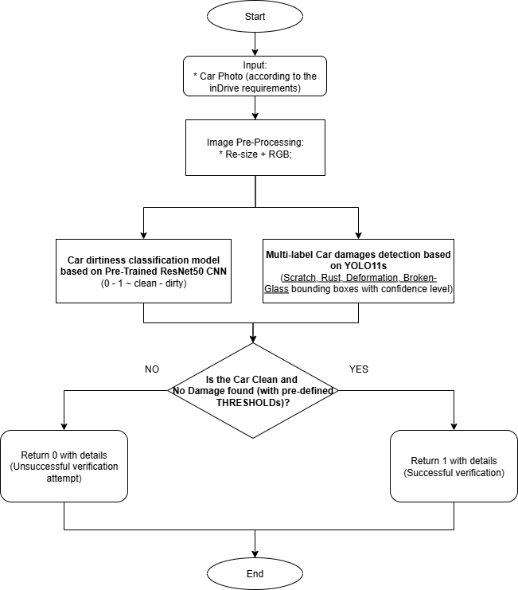
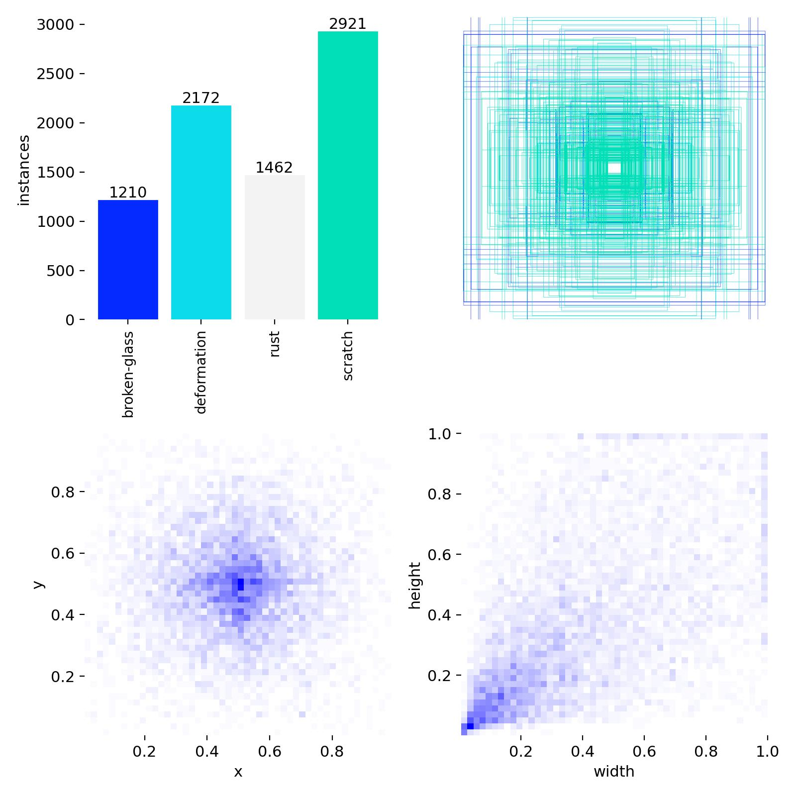
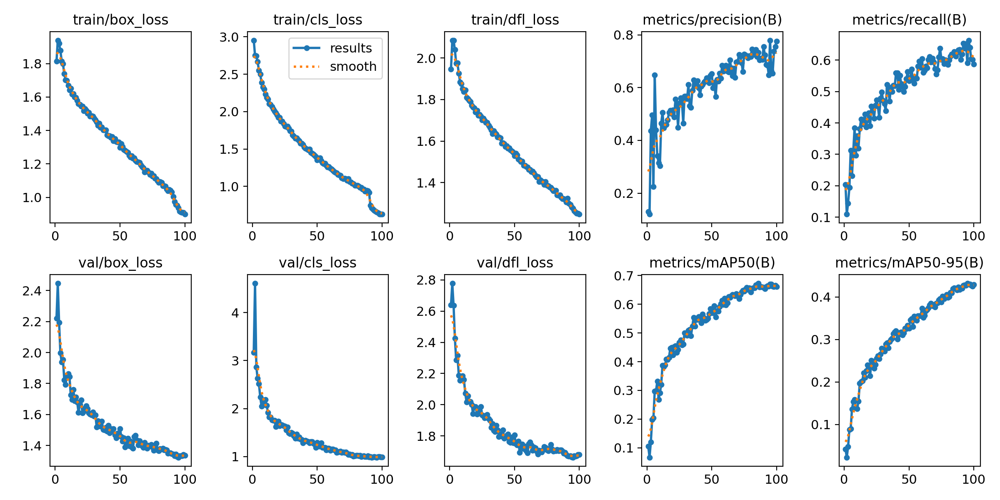
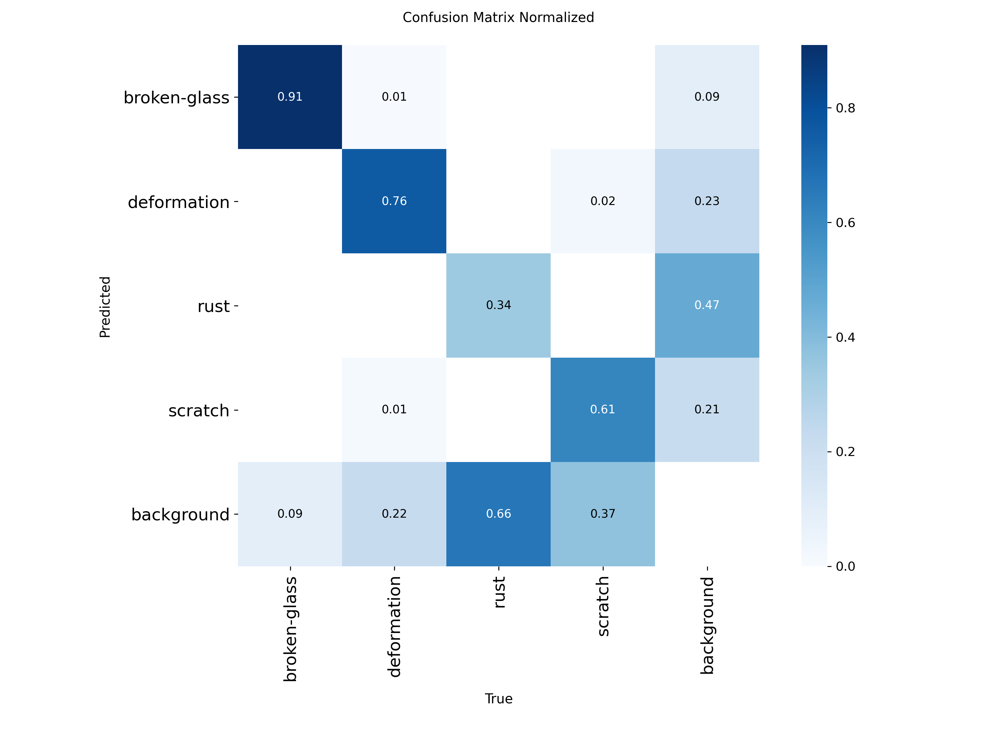
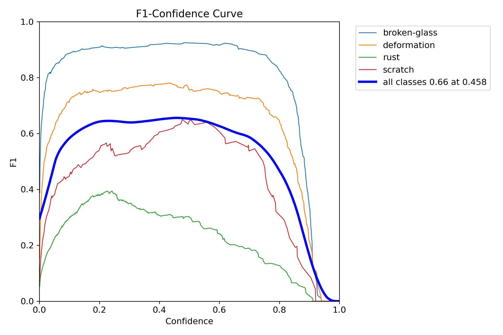
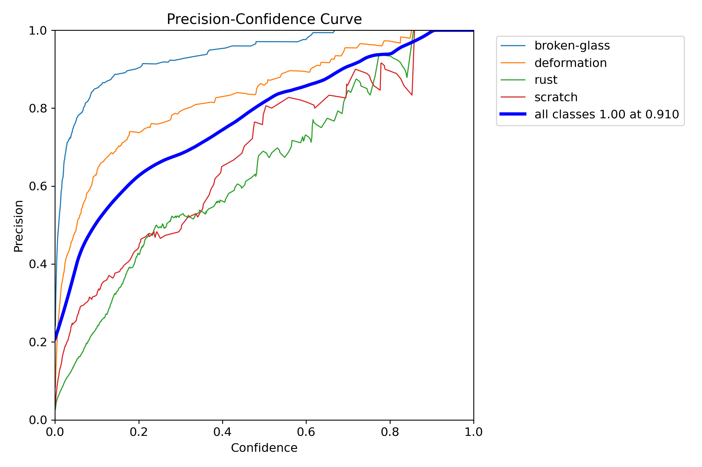
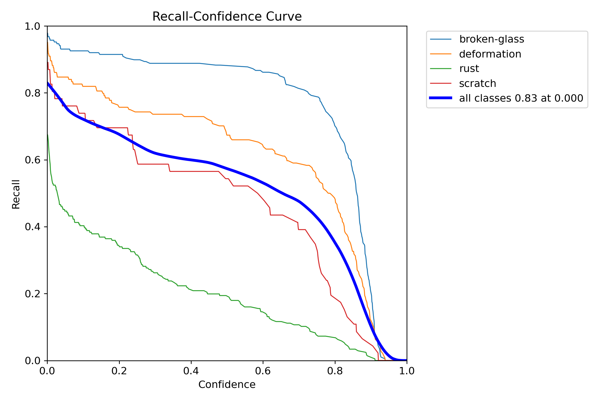
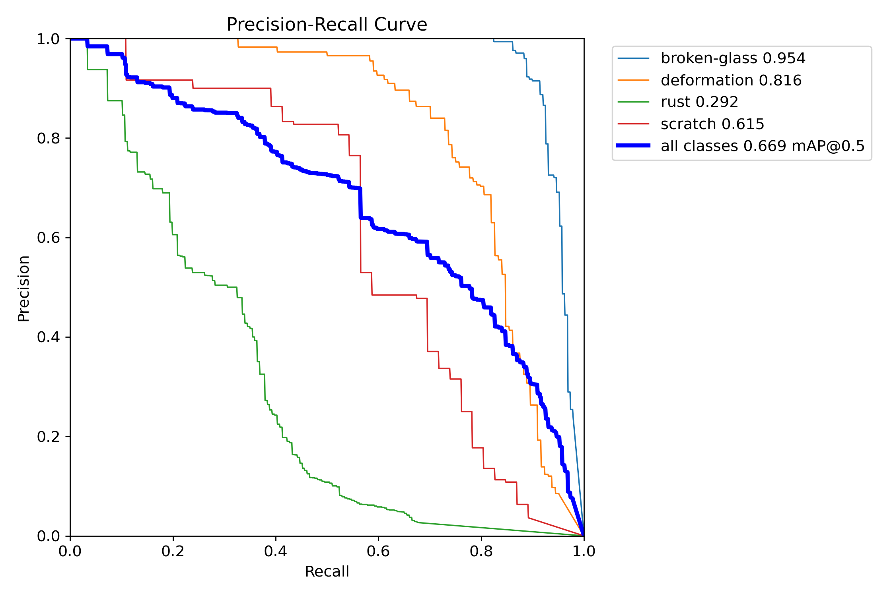
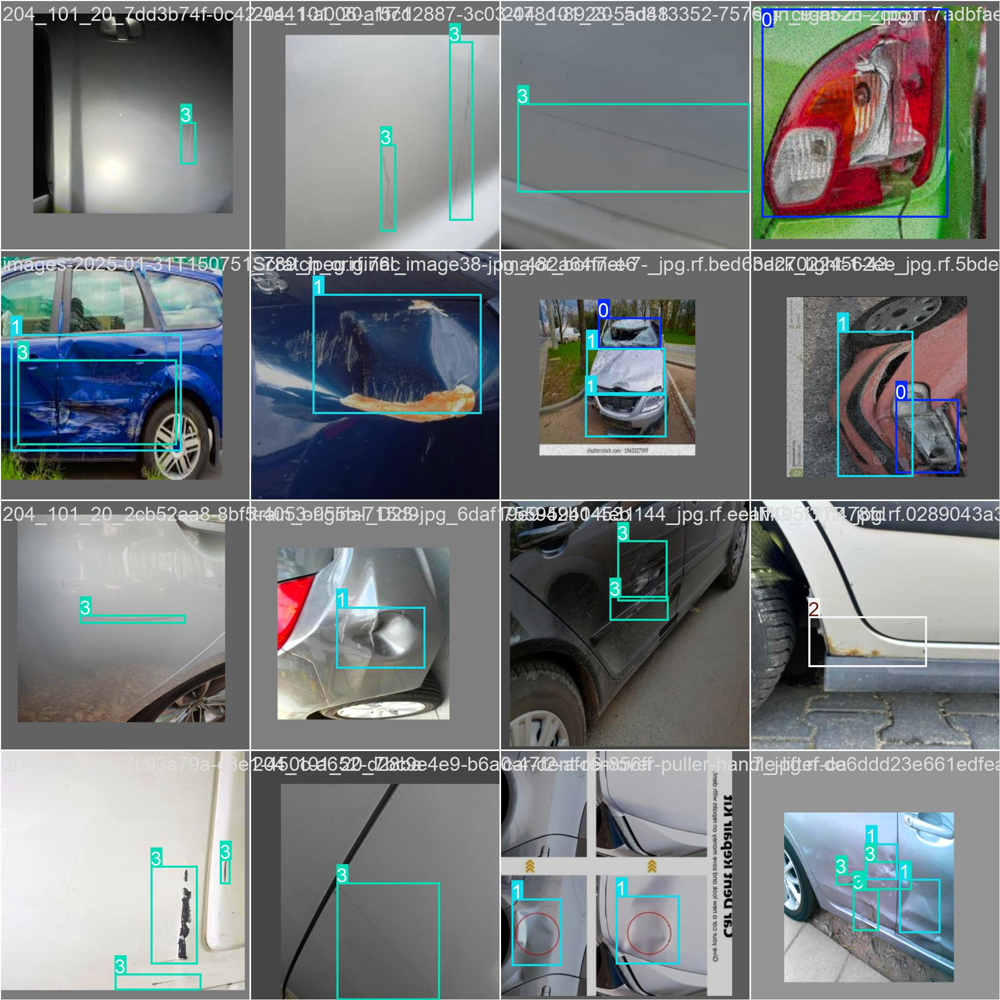

# InDrive Car Verification Service (Dirtiness Classification & Damages Detection)

## Overview

Diagram ~ Architecture:


### Local run mini-guide

1. Create Virtual Environment
```
python -m venv .venv

.venv\Scripts\activate (for Windows)

source .venv/bin/activate (for MacOS or Linux)
```

2. Install requirements:
```
pip install -r requirements.txt
```

3. Download ResNet50 model from this HF link and put it in `models/` folder.
[https://huggingface.co/silvermete0r/best_resnet50_dirtiness_classification/blob/main/resnet50_car_dirtiness.pth](https://huggingface.co/silvermete0r/best_resnet50_dirtiness_classification/blob/main/resnet50_car_dirtiness.pth)

4. Run Streamlit (for GUI inference)
```
cd streamlit-gui

streamlit run app.py
```

5. Run FastAPI (for API inference)
```
fastapi dev app.py
```
then, open http://127.0.0.1:8000/docs

### Docker mini-guide

1. Build the Docker image:
```
docker build -t fastapi-app .
```

2. Run the Docker container:
```
docker run -p 8000:8000 fastapi-app
```

## 1. **Damages Detection**:

Main working / training notebook: [notebooks/Multi_label_Car_damages_detection_based_on_YOLOv11.ipynb](notebooks/Multi_label_Car_damages_detection_based_on_YOLOv11.ipynb)

1.1. Comparing **Instance Segmentation** and **Object Detection** models for damage detection on car images (models were trained on [Roboflow](https://roboflow.com/) platform):

| Model | Method | mAP50 | Precision | Recall | Train Time | Dataset Size | Dataset |
|-------|--------|-------|-----------|--------|------------|--------------|---------|
| Roboflow 3.0 Instance Segmentation | Instance Segmentation | 0.49 | 0.67 | 0.43 | 5h | 1700 (external) | [car-damage-coco-dataset](https://universe.roboflow.com/dan-vmm5z/car-damage-coco-dataset) |
| **🌟 YOLOv11 Object Detection (Fast)** | **Object Detection** | **0.66** | **0.75** | **0.63** | **3h** | 2932 (custom) | [multi-label-car-damage-detection-hfvtf](https://universe.roboflow.com/computer-vision-projects-w1m15/multi-label-car-damage-detection-hfvtf/) |

1.2. Choosing the best multi-label object detection model for car damages detection from YOLOv11 family:

| Model     | mAP (val 50-95) | Speed (CPU ONNX ms) | Speed (A100 / TensorRT ms) | Parameters (M) | FLOPs (B) |
|-----------|------------------|----------------------|-----------------------------|----------------|-----------|
| YOLO11n   | 39.5             | ~56.1                | ~1.5                        | 2.6            | 6.5       |
| **🌟 YOLO11s**   | **47.0**             | **~90.0**                | **~2.5**                        | **9.4**            | **21.5**      |
| YOLO11m | 51.5         | ~183.2               | ~4.7                        | 20.1           | 68.0      |
| YOLO11l   | 53.4             | ~238.6               | ~6.2                        | 25.3           | 86.9      |
| YOLO11x   | 54.7             | ~462.8               | ~11.3                       | 56.9           | 194.9     |

[YOLO11 Performance Benchmarks on COCO Dataset – Ultralytics Docs](https://docs.ultralytics.com/models/yolo11/)

1.3. Custom Dataset for Damages Detection:
 - 4 main labels: 
    - scratch (1,617 labels)
    - deformation (1,397 labels)
    - rust (1,058 labels)	
    - broken-glass (907 labels)
 - Main sources:
    - [car-damage](https://universe.roboflow.com/skillfactory/car-damage-c1f0i)
    - [car-scratch-and-dent](https://universe.roboflow.com/carpro/car-scratch-and-dent)
    - [rust-and-scrach](https://universe.roboflow.com/seva-at1qy/rust-and-scrach)
    - [car-scratch-xgxzs](https://universe.roboflow.com/project-kmnth/car-scratch-xgxzs)
    - [corrosion-of-metal-od](https://universe.roboflow.com/sgga/corrosion-of-metal-od)
    - [car_detection_fast_rcnn](https://universe.roboflow.com/test-qssu6/car_detection_fast_rcnn)
    - [car-cr9cg](https://universe.roboflow.com/egor-6ctjq/car-cr9cg)
  - Total collected, filtered and annotated: 2932 images.
  - The following pre-processing was applied to each image:
    - Auto-orientation of pixel data (with EXIF-orientation stripping)
    - Resize to 512x512 (Stretch) 
    - Augmentation applied (to create 2 versions of each source image):
        * Equal probability of one of the following 90-degree rotations: none, clockwise, counter-clockwise
        * Randomly crop between 0 and 20 percent of the image
  - Dataset split: 88% train (4594), 6% validation (333), 6% test (302)
  - Total pre-processed and augmented dataset size: **5229 images**.
    - Damages are annotated in YOLOv11 format.
    - Dataset is available on [Roboflow](https://universe.roboflow.com/computer-vision-projects-w1m15/multi-label-car-damage-detection-hfvtf/dataset/2)



1.4. YOLO11s model training parameters:
 - Epochs: 100
 - Batch size: 16
 - Image size: 640x640
 - Device: CUDA (Tesla T4 ~ Google Colab)
 - Pre-trained weights: [yolov11s.pt](https://docs.ultralytics.com/ru/models/yolo11/)

### 1.5. Model Results

```text
epoch:                  99
epochs trained:         100
total training time:    9667.58 s (2h 41m)

train/box_loss:         0.8988
train/cls_loss:         0.6274
train/dfl_loss:         1.2478

metrics/precision(B):   0.7753
metrics/recall(B):      0.5866
metrics/mAP50(B):       0.6621
metrics/mAP50-95(B):    0.4286

val/box_loss:           1.3350
val/cls_loss:           0.9875
val/dfl_loss:           1.6800

lr/pg0:                 0.000025
lr/pg1:                 0.000025
lr/pg2:                 0.000025
```

**Best mAP@50 = 0.673 at epoch 85**

**Best Model: [models/besty11.pt](models/besty11_car_demage_detection.pt)**













Example predictions on test dataset:




## 2. **Dirtiness Classification**:

2.1. Dataset for Dirtiness Classification:
 - 2 main labels (manually collected and annotated):
    - clean (200 images)
    - dirty (200 images)
 - Main source: [Stanford Cars Dataset](https://www.kaggle.com/datasets/eduardo4jesus/stanford-cars-dataset)
 - Dataset split: 76% train (305), 13% validation (50), 11% test (45)
 - The following pre-processing was applied to each image:
    - Auto-orientation of pixel data (with EXIF-orientation stripping)
    - Resize to 512x512 (Stretch)
 - The following augmentation was applied to create 3 versions of each source image:
    - Equal probability of one of the following 90-degree rotations: none, clockwise, counter-clockwise
    - Randomly crop between 0 and 20 percent of the image
    - Random brightness adjustment of between -15 and +15 percent
 - Total pre-processed and augmented dataset size: **1010 images**
 - Dataset link: [car-dirtiness-zl2ya](https://universe.roboflow.com/test-8a3qo/car-dirtiness-zl2ya/)

2.2. Comparing **Image Classification** pre-trained models: (Visual Transformer vs. CNN) for dirtiness classification on car images (models were trained on this [Kaggle Notebook](https://www.kaggle.com/code/armanzhalgasbayev/car-dirtiness-classification)):

| Model | Type | Accuracy | Precision | Recall | F1-Score | Train Time | File Size | GFLOPs | Inference Time (CPU ms) |
|-------|------|----------|-----------|--------|----------|------------|--------------|--------|--------------------------|
| **[ResNet50_Weights.IMAGENET1K_V2](https://docs.pytorch.org/vision/main/models/generated/torchvision.models.resnet50.html#torchvision.models.ResNet50_Weights)** | **CNN** | **1.0000** | **1.0000** | **1.0000** | **1.0000** | **93 sec.** | **98 MB** | **4.1** | **5.0** |
| [Swin_V2_T_Weights.IMAGENET1K_V1](https://docs.pytorch.org/vision/main/models/generated/torchvision.models.swin_v2_t.html#torchvision.models.Swin_V2_T_Weights) | Transformer | 1.0000 | 1.0000 | 1.0000 | 1.0000 | 169 sec. | 45 MB | 15.0 | 10.0 |

Download link for the best model: [best_resnet50_dirtiness_classification.pth (HF)](https://huggingface.co/silvermete0r/best_resnet50_dirtiness_classification/blob/main/resnet50_car_dirtiness.pth)

## 3. Final Results

### 3. Final Results

#### Combined Dirtiness & Damage Classification Performance

The following table summarizes the classification results on the test set, combining both dirtiness and damage detection:

|                | Predicted Dirty/Damaged | Predicted Clean |
|----------------|------------------------|-----------------|
| **Actual Dirty/Damaged** | 50                     | 0               |
| **Actual Clean**         | 8                      | 42              |

**Classification Report:**

| Class            | Precision | Recall | F1-Score | Support |
|------------------|-----------|--------|----------|---------|
| Dirty/Damaged    | 0.86      | 1.00   | 0.93     | 50      |
| Clean            | 1.00      | 0.84   | 0.91     | 50      |
| **Accuracy**     |           |        | **0.92** | **100** |
| Macro Avg        | 0.93      | 0.92   | 0.92     | 100     |
| Weighted Avg     | 0.93      | 0.92   | 0.92     | 100     |

- **Accuracy:** 92%
- **Key Insights:**
   - The model perfectly identifies all dirty/damaged cars (recall = 1.00).
   - 8 clean cars were misclassified as dirty/damaged.
   - High precision for clean cars (1.00), indicating very few false positives.
- **Limitations:**
   - Dataset size: 100 images (50 clean / 50 dirty-damaged);